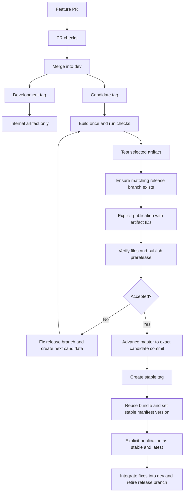

# Contributing to Flash Sync

Flash Sync contains an Obsidian plugin, shared protocol code, and the host-local `fos` server administration CLI. Plugin GitHub Releases contain installation files, not a packaged `fos` executable. See [CLI installation](docs/fos-install.md), [CLI usage](docs/fos-usage.md), and [NATS configuration](docs/nats-setup.md).

## Development setup

Use Node.js 22 and npm. Run commands from the repository root:

```sh
npm ci
npm run build:plugin
npm run build:server-cli
```

The plugin bundle is `packages/plugin/dist/main.js`; the source manifest is `packages/plugin/manifest.json`. For a local test vault, copy both into `.obsidian/plugins/flash-sync/`, then reload Obsidian. Use a disposable vault and test server when testing synchronization. Do not overwrite real vault settings or run `fos bootstrap`, rotation, upgrade, or removal against an existing server as a development check.

The CLI build also generates its administrator worker. `npm run test:server-cli-bundle` verifies both bundles. CLI operations remain operator-owned; developing the CLI does not authorize host changes.

## Branches and PRs

- `dev` receives feature and ordinary bug-fix PRs. Start a short-lived topic branch from current `origin/dev`.
- `release/x.y.z` freezes a selected candidate for stabilization. Branch candidate fixes from it and target their PRs back to that release branch. New features continue into `dev`.
- `master` contains accepted stable source. Stable tags must point to the exact tested candidate commit reachable from `master`.
- Merge release fixes back into `dev` before retiring a release branch. Never move an existing release tag to another commit.

```sh
git fetch origin
git switch -c my-change origin/dev
```

Keep PRs scoped. For behavioral changes, write a requirement-derived failing test, make the smallest correct change, then run focused checks. Include executed verification and any unverified behavior in the PR description. Update relevant docs and OpenSpec deltas together with behavior. Do not claim a local check proves a deployed server or live GitHub release.

## Verification

Start with the affected test file, then broaden at integration:

```sh
npx vitest run tests/unit/plugin-release.test.ts tests/unit/plugin-publication.test.ts tests/unit/ci-workflows.test.ts
npm run typecheck
npm run lint
npm run test:unit
npm run build:plugin
npm run test:server-cli-bundle
npm run test:integration
npm run test:simulation
```

CI additionally runs unit coverage, aggregate coverage, and disposable Docker-backed NATS/MinIO tests:

```sh
NATS_TEST_DOCKER=1 npx vitest run tests/integration/recovery-nats.test.ts
S3_TEST_DOCKER=1 npx vitest run tests/integration/blob-minio.test.ts
NATS_TEST_DOCKER=1 S3_TEST_DOCKER=1 npm run test:coverage:aggregate
```

NATS-dependent CLI/integration tests also need `NATS_SERVER_BIN` pointing to a local `nats-server`; CI downloads and checksum-verifies its disposable binary. Coverage reports upload even when checks fail. A failed check never produces a successful installation artifact.

## Versions and artifacts

| Tag | Source eligibility | Result of tag push |
| --- | --- | --- |
| `0.2.1-dev.8` | Commit reachable from `dev` | Internal installation artifact only |
| `0.2.1-alpha.1`, `0.2.1-beta.1`, `0.2.1-rc.1` | Commit reachable from `dev` or `release/0.2.1` | Candidate installation artifact only |
| `0.2.1` | Commit reachable from `master` | Validation and promotion instructions; no compilation or publication |

`rc` means release candidate: a version expected to be final after acceptance. Using rc tags is optional. Numeric version fields cannot have leading zeroes; candidate/development counters start at 1. Tags have no `v` prefix or build-metadata suffix. The source manifest keeps plain `x.y.z`, matching the tag's base version; packaging writes the exact tag version into a separate installation manifest. These suffixes are SemVer prerelease versions even before any GitHub Release exists.

CI compiles a tagged candidate once and runs all required checks. Its artifact is named `flash-sync-<tag>-<run-id>-<attempt>`, with:

```text
build-info.json
install/main.js
install/manifest.json
install/styles.css       # only when used
```

Download the artifact from its CI run. Copy only files inside `install/` into the plugin directory. `build-info.json` records source/build identity and SHA-256 hashes; it is not an Obsidian installation file. The run summary records run ID, attempt, artifact ID, archive digest, and download link. Never mix files from different builds.

Artifacts request 90-day retention, subject to repository policy. Missing, deleted, expired, or corrupted artifacts block publication. Create and verify a new candidate explicitly if evidence is unavailable; the publisher never silently rebuilds or chooses a newer run. Historical releases without this evidence cannot be automatically promoted.

## Candidate and prerelease cycle

1. Choose a tested commit on `dev`, ensure the source manifest base version matches, and create a candidate tag such as `0.2.1-beta.1`. Wait for the tag's CI run to succeed.
2. Install that exact candidate artifact and test it. Record its run ID, attempt, and artifact ID.
3. Create `release/0.2.1` at the selected tagged commit. Branch CI can run, but branch creation does not publish anything.
4. Dispatch **Plugin publication** explicitly using the same candidate tag as both destination and source. The candidate must be reachable from the matching release branch.

Example commands after selecting the candidate (operators own pushes, tags, and publication):

```sh
git fetch origin --tags
git switch -c release/0.2.1 0.2.1-beta.1
git push -u origin release/0.2.1

publication_branch=$(gh repo view --json defaultBranchRef --jq .defaultBranchRef.name)
gh workflow run plugin-publish.yml --ref "$publication_branch" \
  -f tag=0.2.1-beta.1 -f source_tag=0.2.1-beta.1 \
  -f build_run_id=RUN_ID -f build_run_attempt=ATTEMPT -f artifact_id=ARTIFACT_ID
```

Replace the three uppercase placeholders with actual numeric IDs from the selected successful tag build. The publication workflow and trusted helper scripts must already exist on the repository's default branch. A dispatch from another branch is refused; the default branch is independent of the stable-source `master` requirement.

Publication verifies authoritative run/attempt/workflow/artifact identity, successful required checks, tag/branch eligibility, manifest identity/version, and file hashes. It creates a draft, uploads existing installation files, verifies the entire asset set, then publishes with `prerelease=true` and `latest=false`. It does not install dependencies or compile the plugin.

For a candidate fix, branch from `origin/release/0.2.1`, merge the fix PR into that release branch, create `0.2.1-beta.2`, and repeat build, acceptance, and explicit publication. A release-only fix can build before it merges into `dev`. Publishing an older explicitly selected candidate is allowed if it remains reachable from the release branch; the publisher does not infer which tag is newest.

## Stable promotion

After acceptance, advance `master` to the selected candidate's **exact commit**, preferably by fast-forward. If policy or divergent history creates a new merge commit, build and verify a new candidate at that final commit before stable tagging. Equal trees at different SHAs do not qualify.

Create `0.2.1` at the accepted commit and push the tag. Dispatch Plugin publication again with destination `0.2.1`, the accepted candidate as `source_tag`, and its original run/attempt/artifact IDs:

```sh
gh workflow run plugin-publish.yml --ref "$publication_branch" \
  -f tag=0.2.1 -f source_tag=0.2.1-beta.2 \
  -f build_run_id=RUN_ID -f build_run_attempt=ATTEMPT -f artifact_id=ARTIFACT_ID
```

Stable promotion preserves tested `main.js` and optional `styles.css` bytes and changes only `manifest.version` to `0.2.1`. All other manifest fields remain unchanged. The complete stable package therefore differs from the candidate package. Publication verifies the result, attaches it to a draft, then publishes with `prerelease=false` and `latest=true`. Future build changes that embed tag-specific versions in JavaScript require revisiting this promotion contract.

Verify the published assets and channel, integrate release fixes into `dev`, then retire `release/0.2.1`. Branch merges, deletion, and publication are explicit operator actions. Plugin releases provide `main.js`, `manifest.json`, optional `styles.css`, and GitHub-generated source archives. The source archives require a build; they are not installation packages. `fos` continues to install from repository source.

## Failures, retries, and owner settings

Publication evidence is uploaded separately from installation assets, including selected source identity and original/final hashes. Same-tag publication requests are serialized. Retry with the same inputs: matching interrupted drafts resume by uploading only missing files; complete matching releases succeed without mutation. Unexpected assets, differing bytes/source/channel, and incomplete published releases fail without replacing or deleting content. Inspect the draft or evidence before choosing recovery; never use asset replacement or forced retagging as a retry.

Repository owners should protect release tags and branches, restrict publication access, and enable GitHub immutable releases. Draft-first publication works with immutable releases. These settings are not applied by CI or local development. Verify Actions retention policy and workflow availability before the first publication. Existing public releases remain unchanged during migration. Roll back workflow behavior through a reviewed code change, not release deletion or asset replacement.

## Release cycle


