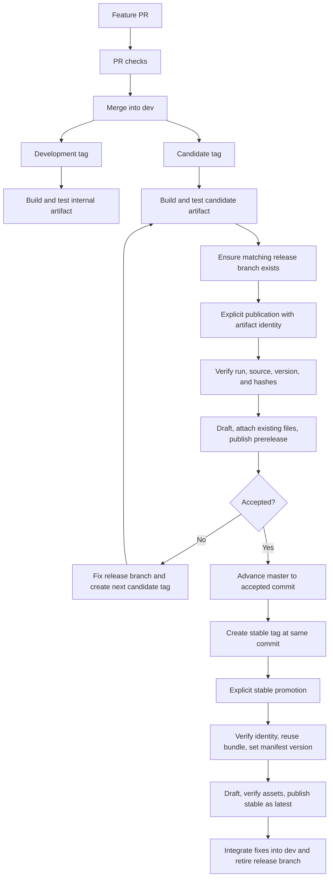

## Context

See `proposal.md` for motivation. Existing `.github/workflows/ci.yml` runs a broad checks job for PRs and `dev`, `master`, and tag pushes. Its tag-only publication job rebuilds the plugin after checks already compiled it and immediately creates alpha/beta or stable Releases. `scripts/plugin-release.mjs` provides strict tag parsing, source-manifest validation, branch reachability, packaging, and installation-directory verification; `tests/unit/plugin-release.test.ts` already exercises these boundaries with disposable Git fixtures.

The source manifest stores a plain base version; packaging writes the exact destination tag into a separate distribution manifest. This supports stable metadata promotion without a source-version commit. Current build commands do not inject tag-derived versions into JavaScript. All release acceptance must distinguish planned behavior, local fixture evidence, and actual GitHub evidence.

The design is required because workflow permissions, artifact identity, retries, and compatibility span CI, release scripts, and documentation. Runtime plugin and server behavior remain unchanged.

## Goals / Non-Goals

**Goals:**

- One compilation of the selected candidate, followed by validation of the exact bytes that will be published.
- Explicit, reproducible publication with a verifiable source run and artifact; no search for the newest artifact or implicit branch-owned tag.
- A small refactor of existing tooling rather than a parallel release implementation.
- A documented operator workflow and compact, portable agent entry point.

**Non-Goals:**

- See the proposal for product and infrastructure exclusions. CI uses only disposable test services.
- No automatic branch creation, merge, deletion, tag creation, public release acceptance, or GitHub settings mutation as an implicit consequence of implementation.
- No general deployment platform, package registry, custom artifact service, or mandatory new attestation infrastructure.

## Decisions

### 1. Keep checks and tag builds together; separate publication

Refactor `ci.yml` as the owner of PR/branch checks and development/candidate builds. Include `release/*` branch pushes so stabilization fixes receive the same checks. For a tag push, validate strict syntax, the source base version, peeled commit, and allowed reachability before compilation. Run the existing typecheck, lint, unit/coverage, CLI bundle, integration, Docker-backed NATS/MinIO, simulation, and aggregate coverage checks without weakening gates. Compile the plugin once in the owning checks job; package and verify the installation artifact only after the required checks succeed. Preserve diagnostic coverage upload on failure and existing coverage badge behavior for `dev`/`master` only.

Stable tag events perform eligibility validation and print promotion instructions, but skip plugin compilation, candidate artifact creation, and automatic publication. A stable tag does not bypass later publication verification.

Add a dedicated `plugin-publish.yml` with `workflow_dispatch`. Inputs are `tag`, `source_tag`, `build_run_id`, `build_run_attempt`, and `artifact_id`; all are explicit, validated strings. For a candidate destination, `tag` must equal `source_tag`. For stable publication, `source_tag` must be an alpha/beta/rc tag of the same base version. No free-form channel or branch input is accepted: derive both from the tags.

A release branch is an eligibility gate, not a publication trigger. Creating it can run ordinary branch CI, but dispatching publication never compiles the plugin. Reuse the existing release helper as the single tag and package contract; factor helpers within the existing scripts area only when necessary for focused tests.

Alternative: a separate tag-build workflow or four chained workflows. Rejected because they duplicate setup or introduce event chains without improving the requested promotion boundary. Do not depend on a Release event created by the workflow token to trigger another stage.

### 2. Use strict version channels and temporary stabilization branches

| Tag | Build eligibility | Publication eligibility |
| --- | --- | --- |
| `x.y.z-dev.N` | Reachable from `dev` | Never a GitHub Release |
| `x.y.z-alpha.N`, `beta.N`, `rc.N` | Reachable from `dev` or `release/x.y.z` | Explicit promotion; reachable from matching release branch |
| `x.y.z` | No new plugin compilation | Exact candidate commit; reachable from `master` |

Retain existing integer restrictions, reject `v` prefixes and build-metadata suffixes, and add `rc.N` to the current parser. `rc` means release candidate; its use is optional and has the same publication gates as alpha/beta.

Create `release/x.y.z` manually at the selected tested candidate commit. Candidate fixes branch from and return to this release branch; new feature PRs continue into `dev`. Tag each new candidate after changes. A commit can be reachable from multiple branches, so ancestry proves eligibility, not historical branch origin.

For stable promotion, advance `master` to the exact accepted commit, preferably by fast-forward. If branch policy or divergent history requires a new merge commit, create and verify a new candidate at that final commit before stable promotion. Equal source trees at different SHAs are not sufficient under this contract. Integrate release fixes into `dev`; retire the release branch only after publication and integration are verified. Existing PR squash behavior for feature work need not change.

Alternative: a permanent prerelease branch and tag selection based on branch contents. Rejected because concurrent release lines and multiple tags make that selection ambiguous.

### 3. Record build evidence without changing installation assets

Use one installation artifact containing `install/main.js`, `install/manifest.json`, optional `install/styles.css`, and `build-info.json` outside `install/`. Users copy only the installation files. Public Release assets retain their existing names and do not include internal metadata or duplicate source archives.

Metadata has a versioned schema and records repository identity, source tag, peeled commit SHA, base version/channel, workflow identity, run ID and attempt, Node version, lockfile hash, and SHA-256 hashes of every installation file. It must not record credentials or environment dumps. Include run attempt in the artifact name so retries cannot confuse artifacts from different attempts. Record authoritative artifact ID and archive digest when returned by GitHub; metadata inside the archive cannot supply its own authoritative artifact identity or archive digest.

Upload only after required checks and installation verification pass. Configure explicit retention of 90 days, bounded by repository policy. Retention is an operational window, not a permanent artifact guarantee; surface artifact expiry in the contribution guide. If evidence expires, block promotion. The operator can create a new candidate tag and tested build explicitly; the publisher never substitutes it automatically.

Alternative: bare files and lookup by latest successful run. Rejected because it cannot unambiguously bind promotion to a tested attempt. A custom permanent storage service is unnecessary for this change.

### 4. Verify identity before granting publication effects

Run the publisher only from the repository's default branch; confirm the dispatch ref and check out trusted helper code from that ref. Do not execute scripts, JavaScript assets, dependency lifecycle hooks, or workflow code downloaded from the candidate artifact. Metadata and dispatch inputs are untrusted data and are parsed strictly; do not interpolate them directly into shell source.

Query GitHub for the selected run, attempt, workflow, and artifact. Verify same repository, approved build workflow identity, `push` tag-build origin, successful conclusion and required jobs, source tag/commit association, artifact/run association, expiry, metadata schema, and content hashes. Resolve current tags to peeled commits and recheck destination branch reachability before release mutations. An arbitrary PR or branch artifact cannot become a release even when its commit matches. Verify the archive digest when GitHub provides it, and always verify installation file hashes. Reject unsafe paths, extra installation files, missing/empty content, and source/version mismatches.

Build checks use `contents: read`; keep coverage Gist credentials scoped to their existing badge use. The publication job uses `actions: read` to inspect runs and download artifacts, and `contents: write` for release mutations, with no additional PAT. Pin newly introduced external actions to reviewed commit SHAs. Existing tag provenance is verified against GitHub run/artifact information, not trusted solely because a JSON file claims success.

Alternative: running the tagged checkout's publication script with a write token. Rejected because selected source code should not obtain publication authority.

### 5. Stable publication changes only manifest metadata

Prerelease publication uploads the exact candidate installation bytes under the same candidate tag. Stable publication requires stable and candidate tags to resolve to the same commit and use the same base version; copy the verified candidate installation directory, replace only `manifest.version`, and verify the final directory. Preserve JavaScript and optional stylesheet hashes and all other manifest fields. Record both candidate hashes and final installation hashes in publication evidence.

Do not run `npm ci`, `build:plugin`, or rebuild tagged code during publication. The stable package is not byte-identical to the beta package because its manifest version changes. If a future build embeds tag-specific versions in JavaScript, fail the no-recompilation precondition and require a separate design update rather than silently publishing contradictory version metadata.

Alternative: recompiling the same commit for each channel. Rejected because it replaces the tested artifact with new bytes and conflicts with the agreed promotion flow.

### 6. Draft first; serialize and verify retries

Use a concurrency group keyed by destination tag with `cancel-in-progress: false`. Before writing, inspect an existing release for the tag. For a new destination, require the tag already exist, create a draft with the intended channel, upload the exact allowed assets, verify the uploaded asset names and hashes, and then publish. Set prereleases to `prerelease=true` and `latest=false`; stable releases use `prerelease=false` and `latest=true`.

For a matching incomplete draft, verify existing assets and upload only missing expected files. For a completed matching release, verify source tag/commit, channel, asset set and hashes and report success without mutation. Unexpected files or different bytes, source or channel are conflicts: fail, preserve content, and never use replacement upload flags. An interrupted operation leaves an inspectable draft, not an incomplete public release.

This protocol supports GitHub immutable releases. Document enabling immutable releases and tag/branch protection as recommended owner configuration; this change does not apply repository settings automatically. Release notes record source tag, commit, run/attempt, artifact ID, and promotion identity for review. Editable notes do not replace authoritative verification. Automatic release notes must use an explicit previous release of the same channel to avoid mixing development tags into stable history.

Alternative: direct published creation followed by uploads. Rejected because immutable releases lock assets at publication and interrupted uploads can expose incomplete releases.

### 7. Put detailed human workflow and concise agent rules in separate files

Create `CONTRIBUTION.md` under the exact requested name. It contains Node.js 22/npm setup, actual package scripts, plugin and CLI development checks, feature/release/master branch rules, tag examples, explicit dispatch inputs, artifact layout and retention, stable source identity, retry/failure handling, and one Mermaid release-cycle diagram. Include examples for fixing a candidate, promoting stable, integrating release fixes into `dev`, and retiring the branch. Link it prominently from README.

Target 80-120 lines for root `AGENTS.md`. Include English output/artifact conventions; portable CodeGraph discovery rules; bounded ownership without automatic delegation; TDD and focused/broader checks; and a small map of `packages/plugin`, `packages/protocol`, `packages/server-cli`, `tests`, `scripts`, `openspec`, and `docs`. Summarize direct WSS/NATS KV synchronization, IndexedDB/outbox, stable file IDs, CAS/revisions, tombstones, conflict preservation, optional S3, vault isolation and SecretStorage. Describe `fos` as host-local server administration for native/Docker/Podman modes, separate vault/admin credentials, and explicit authorization for host/service changes. Include essential build/check commands and compact branch/release instructions, then link to CONTRIBUTION, current specs, `docs/fos-install.md`, `docs/fos-usage.md`, and `docs/nats-setup.md`.

Do not copy historical architecture targets as confirmed runtime guarantees. Preserve existing internal package and deployed-state names; do not rename them to match public branding. Do not embed personal paths, RTK installation assumptions, fixed model assignments, or full CLI option tables. Repository guidance complements the user's global instructions. Contribution docs describe the implemented release behavior only after code and checks are complete; no documentation-only pretence of completed CI refactoring.

Alternative: put the full contributor guide and architecture manual into AGENTS. Rejected because it makes routine agent context large and duplicates existing references.

### 8. Release cycle

## Risks / Trade-offs

- Artifact expiry or deletion blocks publication. Mitigation: explicit retention, expiry visibility, and an operator-created replacement candidate; no silent rebuild.
- Exact SHA equality restricts merge policy. Mitigation: fast-forward accepted source or test a new candidate at the final merge commit before stable tagging.
- Rerunning a tag build can produce another artifact. Mitigation: select exact run, attempt, and artifact identity; never claim tags alone imply reproducible bytes or silently replace a selected build.
- Candidate metadata is not an independent signature. Mitigation: bind it to authoritative same-repository approved workflow/run/artifact information and verify actual files; optional attestations remain follow-up work.
- New dispatch workflow must exist on the default branch. Mitigation: make workflow availability on the default branch an explicit integration acceptance gate before first publication; no automatic merge during planning or local implementation.
- Future version embedding can invalidate metadata-only stable promotion. Mitigation: enforce source/build constraints and fail rather than recompiling inside publication.
- Coverage/badge refactoring can inadvertently reduce existing checks. Mitigation: compare trigger/job/check inventory and preserve separate coverage diagnostic uploads and dev/master badge semantics.

## Migration Plan

1. Add requirement-derived release tests and refactor helpers and CI in the working branch. Verify local fixture behavior and workflow syntax before integration.
2. Update README, contribution/agent guides, and the release contract in the same change. Document that alpha/beta pushes no longer publish automatically.
3. During separately authorized integration, make build and publication workflow definitions available on the required branches and repository default branch. Confirm configured Actions artifact retention and recommended owner-controlled protections; record what remains unconfigured.
4. Keep existing tags, Releases, and uploaded assets untouched. Historical releases lacking new build evidence remain viewable but are ineligible for automatic backfill/promotion.
5. Exercise the lifecycle with disposable local Git and GitHub API fixtures, including failed checks, artifact mismatch/expiry, draft recovery, repeat publication, and stable manifest-only promotion. Live GitHub release/tag creation requires explicit authorization; do not create a stable tag merely to prove acceptance. Mark live behavior unverified until exercised.
6. Roll back workflow behavior only through a reviewed code change. Do not delete public releases, move tags, or replace assets. Existing verified artifacts can remain downloadable; unfinished matching drafts remain available for inspection.
